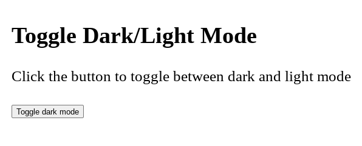
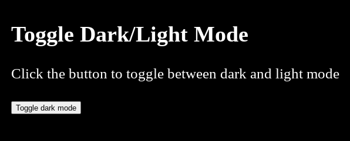

# website-dark-light-mode
A Function that lets you change a webpage its background color

# Support Me
 

# Need Help?

# Demonstrations
Light Mode

Dark Mode

[Check on Replit](https://dark-mode.jtonie.repl.co/)
